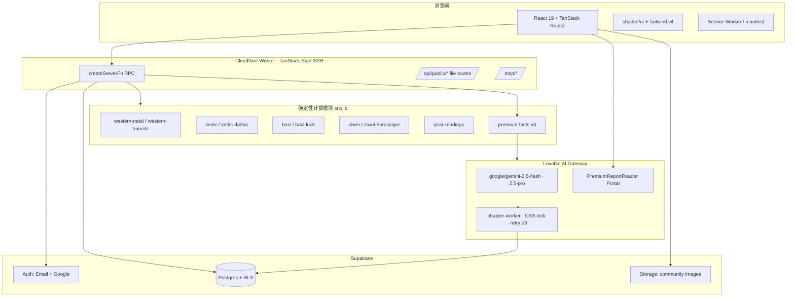

# Fate Nexus 项目交接文档

> 面向新协作者的完整交接。请与代码、迁移文件、Skill 文档、测试同时阅读。

---

## 1. 文档元信息

| 项 | 值 |
| --- | --- |
| 生成日期 | 2026-07-20 |
| 项目名 | Fate Nexus（命运图书馆） |
| Lovable Project ID | `8dd02eb0-ad23-48d1-858e-b5eb297af57e` |
| 线上 URL | https://fate-nexus-ai.lovable.app |
| 预览 URL | https://id-preview--8dd02eb0-ad23-48d1-858e-b5eb297af57e.lovable.app |
| 当前 commit | `60dedb9c39505e2fcb3b9ae2f25d3899a8144efc` |
| 文档适用范围 | 产品、技术架构、数据、AI 报告链路、迭代历史、遗留风险、上手指南 |
| 快照来源 | 仓库当前源码 + `supabase/migrations` + `skills/` + Lovable 会话历史 |

> 本文不含任何 secret / token / 密码 / 完整邮箱 / 用户出生资料。指定测试报告仅保留 `report_id`，其它 UUID 已脱敏。

---

## 2. 30 秒摘要

- **产品是什么**：面向中文用户的自我探索平台。用户输入出生资料，系统用 4 个传统体系（西方占星 / 印度占星 / 八字 / 紫微）做**确定性排盘**，再让 AI 在事实之上生成解读。
- **现阶段能做什么**：注册登录、开始仪式建盘、免费网页报告、¥79 **模拟支付**解锁 24 章高级报告、个人中心永久重开与删除、长老对话/树洞、生命时间轴、云端社群（同门）。
- **最重要的未完成事项**：
  1. **真实支付未接入**（¥79 仍为 mock）；
  2. `scripts/_reset.mjs` / `scripts/_exhaust.mjs` 一次性人工改库脚本仍在仓库，需审计/删除；
  3. Placidus/Koch 分宫制、Sentry、App 封装、真实用户规模压测尚未做；
  4. `PRD.md` / `PRODUCT.md` / `README.md` 与当前实现存在漂移，需重写或标注失效。

---

## 3. 产品背景与原则

- **四体系合璧**：西方占星（Whole Sign 整宫制）、印度占星（Vimshottari 大限）、八字（四柱十神大运）、紫微斗数（十二宫主星四化）。
- **定位**：文化探索 / 自我反思，不是命理神断。
- **免责红线**：**不承诺**医疗诊断、法律建议、投资收益、唯一正缘、必婚年、灾祸预警。所有 AI 输出遵循此边界。
- **AI 边界**：AI 仅在已计算好的 `PremiumFacts` 之上写解读文字，从不计算星盘/大运/宫位/相位。

---

## 4. 当前用户完整链路

```
访问首页 (/)
  → 注册 / 登录 (/auth) —— 邮箱密码 + 邮件验证；Google OAuth；无手机号 OTP
  → 开始仪式 (/ritual) —— 姓名、公历生日、出生时间、出生地（城市 combobox 转经纬度）、性别（此处强制采集）
  → 确定性排盘（本地 + 缓存至 charts 表；同 user + 同 canonical_hash 去重）
  → 免费网页报告 (/report) —— 四传统解读 + 生命时间轴（YearByYearChart）
      · 点年份 / 折线点 → YearInsightModal（确定性 year_readings_v1）
      · 长老对话 / 树洞（ElderCompanion）
  → ¥79 高级报告（PremiumPdfCard）
      · 未购买 → MockPaymentModal（微信/支付宝/Visa/银联，均为测试支付）
      · 已购未生成 → 「开始生成完整报告」
      · 生成中 → 24 章实时进度（当前章节名 + 可安全离开提示）
      · partial/failed → 「继续生成」
      · completed → 「查看完整报告」→ PremiumReportReader 全屏 Portal 弹层
  → 个人中心 AccountModal —— 命盘列表、报告列表、删除命盘/仅报告、永久重开报告
  → 同门社群 (/community) —— 发帖 / 评论 / 点赞 / 最多 4 张图
```

---

## 5. 当前技术架构图



---

## 6. 数据与安全

### 主要表

| 表 | 用途 | 关键 RLS |
| --- | --- | --- |
| `charts` | 用户命盘（含 canonical_input_hash 去重） | owner-only |
| `premium_pdf_reports` | 高级报告主记录（status / content_json / content_hash / revision） | owner-only 读；service_role 写 |
| `premium_report_chapters` | 24 章逐行（body / evidence_refs / claim_token / attempt_count） | 通过 SECURITY DEFINER RPC 访问 |
| `premium_report_orders` | ¥79 订单（mock_ 前缀） | owner-only 读；**无客户端写入策略**（仅 service_role） |
| `year_readings_v1` | 确定性年度解读缓存 | owner-only |
| `ai_usage_ledger` | 每次 AI 调用的 provider/model/tokens/cost | admin-only 读 |
| `community_posts` / `community_comments` | 同门社区帖子与评论 | authenticated 读；作者写/删 |
| `community_likes` | 点赞 | **仅 authenticated 读**（2026-07-19 修复，`anon` 已 REVOKE） |
| `user_roles` | 角色（admin/user）+ `has_role()` SECURITY DEFINER | 防特权升级 |

### 关键安全机制

- 出生资料（生日/出生地/性别）属**敏感隐私**，仅在 owner 上下文可读；AI prompt 不发送姓名以外的 PII。
- 章节生成使用 `claim_premium_chapter_for_user` RPC 做 **CAS 锁 + 2 分钟 TTL**。
- 社区图片走 Supabase Storage 签名 URL；单图 ≤5MB；帖子 ≤4 图。
- Admin 角色通过 `user_roles` + `has_role()` 校验，不能存于 profile。
- 2026-07-19 修复：`community_likes` 移除 anon SELECT，防止通过点赞记录反推用户身份。

---

## 7. AI 与计算边界

| 场景 | Token 消耗 |
| --- | --- |
| 本地确定性计算（排盘、facts、year_readings） | **0** |
| 查看已完成报告（cache hit，input_hash 命中） | **0** |
| 首次生成 24 章 | ≈ 300–400k input / 40–60k output |
| 失败章节重试（最多 3 次） | 仅重跑失败章节 |

- **AI 不计算**：所有星盘/大运/宫位/相位/十神/四化/dasha 由 `src/lib/*` 模块计算。
- **facts 版本**：`PREMIUM_FACTS_VERSION = "premium_facts_v4"`。
- **Whole Sign 整宫制**已接入并在文案中显式标注；**Placidus / Koch 未可靠接入**，客户侧不显示相关 raw tag。
- 章节 prompt 只切入 `allowed_facts` 声明的子树，从不塞整棵事实树或旧的网页报告文本。

---

## 8. 高级报告完整说明

### 商品

- 价格 **¥79**，一次解锁 `user_id + chart_id` 组合；模拟支付（微信/支付宝/Visa/银联仅是 UI，无真实结算）。
- 订单前缀 `mock_*`，服务端要求 `PAYMENT_MODE=mock` 才铸造。

### 24 章 manifest

| kind | 章节 |
| --- | --- |
| cover | 开篇 / 执行摘要 / 命盘导览 |
| system | 西方本命、西方相位、印度本命、Vimshottari、八字四柱、八字十神、八字大运、紫微宫、紫微流曜 |
| cross | 跨体系共识 / 跨体系张力 |
| life | 性格 / 事业 / 财富 / 关系 / 家庭 / 健康 / 使命 |
| timing | 未来 12 月 / 关键窗口 |
| closing | 方法论与免责声明 |

### 契约

- 输出严格 `{ body, evidence_refs }` JSON，`ChapterJsonSchema` 校验。
- `evidence_refs`：module 必属该章 `allowed_facts`；path 必在 facts 树中真实存在；服务端 `chooseDeterministicRefs` 做**确定性证据校正**。
- 每章最多 **3 次**重试；失败入 `ai_usage_ledger`。
- 预算耗尽 → 报告 `partial`；下次续跑只处理 `pending` / `failed(<3)` / 锁过期。
- 完成后 `content_hash` 由所有 24 章 body+refs 有序哈希得到；**completed 后不可变**。
- **复开 0 调用**：`ensurePremiumReportForChart` 直接返回 `content_json`。

### Skill

- 路径：`skills/fate-nexus-premium-report/`
- `SKILL.md` + `references/{chapter-manifest, evidence-contract, token-cache-policy}.md`
- 版本常量（`src/lib/premium-chapters-v3.ts`）：
  - `PREMIUM_SKILL_ID = "fate-nexus-premium-report"`
  - `PREMIUM_SKILL_VERSION = "1.0.0"`
  - `PREMIUM_MANIFEST_VERSION = "2026-07"`
  - `PREMIUM_REPORT_REVISION = "premium_v3_rev_2026_07_real_ai"`

---

## 9. 已验证真实 AI 报告

| 项 | 值 |
| --- | --- |
| Report ID | `274c92fb-7fdd-490c-8991-c2a02ec81f6f` |
| Chart / User / Order | 已脱敏 |
| 状态 | `completed`（24/24） |
| Provider | `lovable-ai-gateway` |
| 主模型 | `google/gemini-2.5-flash` |
| 最后 3 章升级模型 | `google/gemini-2.5-pro`（convergence / tensions / year_ahead） |
| content_hash | `f0168293…add216e7` |
| 最后一轮 tokens | input 26 641 / output 13 416 |
| 复开验证 | `callsAttempted=0`, hash 不变 ✅ |

> ⚠️ 这只是**指定测试报告**的通过验证，不代表已完成新用户全链路生产压测。

---

## 10. UI / 响应式进展

- **iPhone 孤字**：使用 `text-fluid-hero-zh` 修正窄屏中文标题。
- **Reader Portal 根因**：Framer Motion 的 `transform` 会建立新的 containing block，导致 `position: fixed` 相对动画父节点定位。解决方案：`createPortal` 挂到 `document.body`。
- **视口测量**：桌面 1440×900（reader 1320px，侧栏 280px，正文 748px，无横向溢出）；移动 390×844、430×932（100dvh 全屏、目录抽屉、body scroll lock）。
- 全局树洞小图标（SageAvatar）。

---

## 11. 社群 / 同门

- 云端论坛：`community_posts` / `community_comments` / `community_likes`。
- 图片：Supabase Storage，Signed URL，单张 ≤5MB，JPG/PNG/WEBP，单帖 ≤4 图。
- 无限滚动加载。
- 删除权限：作者自删；admin 可全删。
- 当前限制：作者 UUID 会通过评论/点赞 join 潜在暴露给已认证用户；`community_likes` 已限 authenticated。

---

## 12. 版本迭代表

| 阶段 | 目标 | 重点改动 | 验证 | 遗留 |
| --- | --- | --- | --- | --- |
| 初版框架 | 首页 / 四传统页 / 账户 | routes + shadcn 主题 | 手工 | PRD 尚新 |
| 认证重构 | 邮箱密码 + 邮件验证 + Google，淡化手机号 | `/auth`、Supabase Auth 配置 | 手工登录 | 邮件送达需生产验证 |
| 性别前移 | 移除报告页性别补填 | Ritual 强制采集，报告页仅提示重建 | UI 测试 | — |
| 命盘存储 | 云端保存、canonical_hash 去重、删除 | `charts` 表 + `AccountModal` | 单元 + E2E | — |
| ¥99 PDF → ¥79 网页 | 取消 PDF 导出，改为网页内永久报告 | `PremiumPdfCard`、Reader 单栏 | 手工 | 名字仍叫 `PremiumPdfCard` |
| 报告 UI 重排 | 单栏 1100px、状态感知按钮、无 PDF 字样 | `PremiumPdfCard` 重写 | 视觉回归 | — |
| 24 章 v3 | manifest、evidence、CAS 锁、ledger、预算、断点 | `premium-chapters-v3` + RPC | 集成测试 | — |
| facts v4 | 四体系周期扩展（bazi transient / ziwei day / western SP） | `premium-facts.ts` | `premium-facts-v4.test.ts` | Placidus 未接 |
| Real AI 21/24 → 24/24 | 最后 3 章定向修复 | `chooseDeterministicRefs` + 升级 gemini-pro | Report 274c92fb 完成 | — |
| Reader Portal | Framer 定位修复；Whole Sign 说明 | `createPortal` | 1440/390/430 视觉 | — |
| Premium Skill | `fate-nexus-premium-report/` + 385 tests | Skill 三文档 + 契约测试 | 385/385 + tsgo clean | — |
| 社区安全修复 | community_likes 取消 anon 读取 | RLS + REVOKE | 安全扫描通过 | 全量测试**未在 commit 后重跑** |

---

## 13. 当前仓库文件总览

> 只标出关键业务与生成/一次性文件；shadcn ui 46 个组件不逐项解释。

### 一级

```
AGENTS.md  PRD.md  PRODUCT.md  README.md   ← ⚠️ 与实现存在漂移
package.json  bunfig.toml  vite.config.ts  tsconfig.json  components.json
eslint.config.js  .prettierrc  .prettierignore
supabase/config.toml   ← 自动生成，勿改项目级设置
public/{manifest.webmanifest, sw.js, offline.html, robots.txt}
```

### `src/routes/`（TanStack file-based）

- 页面：`index.tsx`, `about.tsx`, `auth.tsx`, `auth.index.tsx`, `auth.reset.tsx`, `ritual.tsx`, `report.tsx`, `synthesis.tsx`, `traditions.tsx`, `community.tsx`, `privacy.tsx`, `terms.tsx`, `delete-account.tsx`
- `__root.tsx`（head/meta）
- `_authenticated/route.tsx`（登录守卫）+ `_authenticated/admin.tsx`
- **dev/test-only**：`dev.demo-premium.tsx`, `dev.reader-harness.tsx`
- API：`api/generate-avatar.ts`, `sitemap[.]xml.ts`, `mcp.ts`, `[.mcp]/**`, `[.well-known]/oauth-protected-resource.ts`, `[.]lovable.oauth.consent.tsx`
- ⚠️ 生成勿改：`src/routeTree.gen.ts`

### `src/components/`

- 业务：`AccountModal.tsx`, `CityCombobox.tsx`, `ElderCompanion.tsx`, `LibrarySplash.tsx`, `MockPaymentModal.tsx`, `PremiumPdfCard.tsx`, `PremiumReportReader.tsx`, `ReportExtras.tsx`, `SageAvatar.tsx`, `TraditionModal.tsx`, `YearInsightModal.tsx`
- `charts/DestinyCharts.tsx`
- `ui/` × 46（shadcn 组件，样式定制走 `styles.css`）

### `src/lib/`（核心业务与计算）

- 计算：`western-natal.ts` / `western-transits.ts` / `vedic.ts` / `vedic-dasha.ts` / `bazi.ts?`（含 bazi-luck）/ `ziwei.ts` / `ziwei-horoscope.ts` / `lunar.ts` / `planet-reading.ts` / `energy-score.ts`
- 报告：`premium-facts.ts` / `premium-chapters-v3.ts` / `premium.functions.ts` / `chapter-json-schema.ts` / `chapter-state.ts` / `chapter-worker.ts` / `budget-policy.ts` / `report-input.ts` / `report.functions.ts` / `reports-store.functions.ts` / `premium-reader-fixture.ts` / `premium-demo-v3.ts`
- 年度：`year-readings.ts` / `year-readings.functions.ts`
- 阅读器：`reader-nav.ts`
- 其它：`account.functions.ts` / `account.tsx` / `admin.functions.ts` / `community.functions.ts` / `elder.functions.ts` / `oracle.functions.ts` / `outlook.functions.ts` / `key-events.functions.ts` / `tarot-*` / `ai-gateway.server.ts` / `ai-guardrails.ts` / `ai-cache-version.ts` / `rate-limit.server.ts` / `session.ts` / `i18n.tsx` / `typography.tsx` / `legal.tsx` / `error-*` / `lovable-error-reporting.ts` / `pwa-register.ts` / `city-geo.ts` / `cities.ts` / `utils.ts` / `mcp/`
- 测试：与实现同目录 `*.test.ts`

### `src/integrations/supabase/`

- ⚠️ **自动生成勿改**：`client.ts`, `client.server.ts`, `auth-middleware.ts`, `auth-attacher.ts`, `types.ts`
- 环境：`.env` 中 `VITE_SUPABASE_*` 自动生成

### `scripts/`

| 文件 | 状态 |
| --- | --- |
| `run-real-ai-generation.mjs` | ✅ 一次性管理员运行器；需 admin token；生产环境须加保护 |
| `e2e_premium.mjs` | ✅ E2E 演练 |
| `_reset.mjs` | ⚠️ **仍在仓库**，一次性把某 report 3 章 failed → pending 重置。应删除或迁入受保护 admin 工具 |
| `_exhaust.mjs` | ⚠️ **仍在仓库**，把 3 章 `attempt_count` 强制拉满以证明「复开 0 调用」。同上，须删除/审计 |
| `scripts_e2e_premium.mjs` | 疑似遗留副本，需清理 |

### `skills/fate-nexus-premium-report/`

- `SKILL.md` + `references/chapter-manifest.md` + `references/evidence-contract.md` + `references/token-cache-policy.md`

### `supabase/pending/`

- `20260717_premium_chapters_and_ai_usage.sql` —— 需核实是否已被 `20260717*` 正式 migration 取代；文件名残留不代表未应用。

### 顶层残留

- `tmp_body`, `tmp_repro.ts` —— 调试残留，可删。

### `src/assets/`

`ancient-library-hall.jpg`, `tradition-astrology.jpg`, `tradition-bazi.jpg`, `tradition-jyotish.jpg`, `tradition-ziwei.jpg`, `tree-of-destiny.jpg`

---

## 14. 数据库迁移时间线

> 未打开逐个 SQL；仅按文件名与已知上下文归类。**打勾者**表示可从上下文合理推断，**❓** 需打开 SQL 确认。

| 文件名（前缀日期） | 推断用途 |
| --- | --- |
| `20260715032632_*` | ❓ 初始 schema（profiles / charts?） |
| `20260715032718_*` | ❓ RLS / grants |
| `20260715051446_*` / `_51459_*` / `_52601_*` | ❓ 认证与 owner 隔离 |
| `20260715055912_*` / `_55939_*` / `_60726_*` / `_65830_*` | ❓ charts 与 canonical_hash 去重 |
| `20260716032053_*` | ❓ premium 订单 / RLS |
| `20260716132926_*` / `_141659_*` / `_141753_*` | ❓ premium_pdf_reports 主表与 content_json |
| `20260717004244_*` / `_012357_*` | ❓ premium_report_chapters 与 CAS RPC |
| `20260717030250_*` / `_031548_*` / `_031650_*` | ❓ ai_usage_ledger / budget |
| `20260717073923_*` / `_074039_*` / `_074111_*` / `_074145_*` | ❓ chapter locks / retry 字段 |
| `20260717081407_*` / `_182527_*` | ❓ community 系列表 |
| `20260718083434_*` | ❓ year_readings_v1 |
| `20260719070511_*` | ✅ 社区安全扫描修复（community_likes 取消 anon SELECT + REVOKE） |
| `supabase/pending/20260717_premium_chapters_and_ai_usage.sql` | ❓ 是否已被上述正式 migration 覆盖，需 diff |

> **行动项**：接手后请对每条 migration 打开 SQL 补充「表 / 策略 / grants」一栏，并合并/删除 `pending/` 文件。

---

## 15. 测试与质量

### 最新有证据的运行

- 2026-07-20 之前 skill 提交时：**385 / 385 pass**，`tsgo --noEmit` 0 errors。
- **社区安全扫描 commit 60dedb9 之后**：全量测试**未再证据化重跑**。接手第一步建议：`bun test` + `tsgo --noEmit`。

### 测试文件分类

| 类别 | 代表 |
| --- | --- |
| 计算器单元 | `western-natal.test.ts`, `vedic-dasha.test.ts`, `bazi-luck.test.ts`, `ziwei-horoscope.test.ts`, `western-transits.test.ts`, `energy-score.test.ts`, `lunar` |
| Facts | `premium-facts.test.ts`, `premium-facts-v4.test.ts`, `premium-facts-paths.test.ts` |
| 报告契约 | `premium-chapters-v3.test.ts`, `chapter-json-schema.test.ts`, `chapter-state.test.ts`, `chapter-worker.test.ts`, `budget-policy.test.ts`, `canonical-chart-input.test.ts`, `skill-fate-nexus-premium-report.test.ts` |
| 集成/E2E | `premium-e2e.test.ts`, `premium-inmem-integration.test.ts`, `premium-revision-integration.test.ts`, `premium-step-protocol.test.ts`, `premium-rpc-binding.test.ts`, `premium-sql-invariants.test.ts`, `premium-progress.test.ts`, `premium-cache.test.ts`, `premium-audit.test.ts`, `premium-demo-v3.test.ts`, `premium-generation-mode.test.ts`, `premium-mock-payment.test.ts`, `premium-pricing.test.ts` |
| 年度 | `year-readings.test.ts`, `year-readings-self-heal.test.ts` |
| UI | `premium-reader.e2e.test.ts`, `mock-payment-modal.test.ts`, `year-insight-modal.test.ts`, `customer-admin-copy.test.ts`, `hero-typography.test.ts` |
| 视觉 | `tests/visual/run.py`（Playwright 驱动，Python） |

---

## 16. 当前完成度矩阵

| 模块 | 状态 |
| --- | --- |
| 邮箱 / Google 登录 | ✅ 已上线（邮件送达依赖 Supabase SMTP，未做生产验证） |
| 开始仪式 / 命盘去重 | ✅ |
| 四体系确定性排盘 | ✅ |
| 网页免费报告 | ✅ |
| ¥79 高级报告链路 | ✅ 功能完备（**支付为 mock**） |
| 24 章生成 + 断点续跑 + 复开 0 调用 | ✅ 一次真实 AI 完整通过 |
| Reader 全屏 Portal | ✅ 1440 / 390 / 430 视觉验证 |
| Whole Sign 整宫制 | ✅ 客户可见 |
| Placidus / Koch | ❌ 未可靠接入，raw tag 已在客户端隐藏 |
| 生命时间轴 + YearInsightModal | ✅ 确定性 |
| 长老对话 / 树洞 | ✅ |
| 同门社群（帖子/评论/点赞/图片） | ✅（2026-07-19 已修一处 anon 读取） |
| MCP 工具 | ✅ Basic |
| PWA | ✅ Basic |
| **真实支付** | ❌ 微信 / 支付宝 / Visa / 银联 / Apple Pay 全部为 UI 模拟 |
| **邮件送达** | ⚠️ 依赖 Supabase 邮件配置 / 额度 / SMTP，需生产验证 |
| Sentry / APM | ❌ |
| App 封装 / 上架 | ❌ |
| 真实用户规模压测 & AI 成本控制 | ❌ |
| PRD / PRODUCT / README | ⚠️ 已过时（仍写 PDF、¥99、手机 OTP 等） |

---

## 17. 已知技术债 / 风险

- **文档漂移**：`PRD.md` / `PRODUCT.md` / `README.md` 未跟上最新迭代（PDF/¥99/手机号 OTP 等）。
- **脚本残留**：`scripts/_reset.mjs`、`scripts/_exhaust.mjs`、`scripts_e2e_premium.mjs`、`tmp_*` 应删除或迁入受保护 admin 工具。
- **真实支付**：pricing 逻辑、幂等、退款、发票、税务全未做。
- **邮件**：Supabase 默认邮件不适合生产量级，需接自有 SMTP。
- **计算器精度**：Whole Sign 已接入；其它分宫制、月相高级参数、时区历史修正需专家复核。
- **AI 成本**：单份报告约 ¥0.3 成本，$0.04 USD，未做速率限制与并发上限。
- **Cloudflare Worker 兼容**：禁止 Node-only 依赖；`nodejs_compat` 下 `child_process` / `sharp` / `puppeteer` 不可用。
- **隐私删除**：`deleteChart` 只删主表，未主动清理 `year_readings_v1` / `premium_*` 缓存与关联对象（需要 cascade 审计）。
- **社区 UUID 暴露**：作者 UUID 可能通过 comments/likes join 侧信道暴露给已认证用户。
- **禁止 silent template fallback**：`deterministicChapterBody` 仅用于 dev harness / 测试；生产必须让校验失败大声报错。
- **管理员端**：`_authenticated/admin.tsx` 权限校验须以 `has_role()` 为准，禁止用 profile.role。

---

## 18. 下一步优先级

### P0（上线阻塞）

1. **接入真实支付**（首推微信/支付宝，其次 Visa via Stripe）。验收：真实订单 → 服务端签名回调 → `premium_report_orders` 落库 → 24 章生成成功；幂等；退款接口。
2. **删除或加锁 `_reset.mjs` / `_exhaust.mjs`**。验收：仓库不再有可直接跑的删数据/改状态脚本。
3. **邮件送达**：接自有 SMTP + 域名 SPF/DKIM/DMARC；验收：注册/找回密码送达率 >99%。
4. **`PRD.md` / `PRODUCT.md` / `README.md` 重写**或**标注失效**。
5. **全量测试 + tsgo 于当前 commit 再跑一次**并存档结果。

### P1（体验）

6. Sentry 前后端接入；AI 失败/预算耗尽/RPC 错误自动上报。
7. 生产真实用户全链路压测（10 → 100 → 1000 并发章节）。
8. 报告导出（PDF/长图）—— 但注意 `sharp/puppeteer` 在 Worker 不可用，需外部服务。
9. Placidus/Koch 分宫制或明确产品决策仅 Whole Sign。
10. 社区作者匿名化（`author_pseudonym`）与隐私删除 cascade。

### P2（App）

11. Capacitor / RN 封装；iOS / 安卓上架。
12. 会员订阅（月/年）与积分体系。

---

## 19. 协作者上手指南

### 环境

- Node 20+；`bun` 1.x；`tsgo`（项目自带）。
- 数据库、AI Gateway 均由 Lovable Cloud 托管，不需自建。

### 安装 & 常用命令

```bash
bun install
bun test                      # 全量单元 / 集成
bunx tsgo --noEmit            # 严格类型
bun run dev                   # 通过 Lovable preview 或本地 vite
python tests/visual/run.py    # 视觉回归（Playwright）
```

### 禁改文件

- `src/routeTree.gen.ts`
- `src/integrations/supabase/{client,client.server,auth-middleware,auth-attacher,types}.ts`
- `.env` 中 `VITE_SUPABASE_*`
- `supabase/config.toml` 项目级设置

### 推荐先读

1. `skills/fate-nexus-premium-report/SKILL.md` + 三个 reference
2. `src/lib/premium-chapters-v3.ts`（版本常量、24 章 catalog）
3. `src/lib/premium.functions.ts`（server 编排）
4. `src/lib/premium-facts.ts`（facts 契约）
5. `src/lib/chapter-json-schema.ts`（输出校验）
6. `src/components/PremiumPdfCard.tsx` + `PremiumReportReader.tsx`
7. `docs/PROJECT_HANDOFF.md`（本文档）

### 安全测试规范

- 使用 `dev.reader-harness` / `dev.demo-premium` 路由（无需登录）。
- 使用 `premium-reader-fixture.ts` 或 deterministic provider。
- 测试临时数据必须以 `e2e-` / `fixture-` 前缀命名，`finally` 清理。
- **禁止**直接对生产数据跑 `_reset.mjs` / `_exhaust.mjs`。
- 修改 Skill 时必须同步：
  - `PREMIUM_SKILL_VERSION`（semver）
  - `PREMIUM_MANIFEST_VERSION`
  - `PREMIUM_REPORT_REVISION`（不同则新报告写入新行，旧完成报告不可变）
  - `skills/…/references/chapter-manifest.md` 表格
  - 契约测试 `premium-chapters-v3.test.ts` / `skill-fate-nexus-premium-report.test.ts`

---

## 20. 术语与关键常量

| 术语 | 说明 |
| --- | --- |
| Whole Sign | 西方占星整宫制，本项目采用 |
| Vimshottari | 印度占星 120 年大限周期 |
| 四化 | 紫微斗数化禄/权/科/忌 |
| PremiumFacts | 确定性事实树，AI 只读不写 |
| Chapter | 24 章之一，`premium_report_chapters` 一行 |
| content_hash | 报告 24 章有序哈希；completed 不可变 |
| input_hash | canonical facts + facts_version + skill_version + manifest_version + lang + revision |
| CAS 锁 | `claim_premium_chapter_for_user` RPC，TTL 2 分钟 |
| deterministic provider | 测试专用假 provider，产出稳定 body |

### 关键常量

```ts
PREMIUM_FACTS_VERSION       = "premium_facts_v4"
PREMIUM_SKILL_ID            = "fate-nexus-premium-report"
PREMIUM_SKILL_VERSION       = "1.0.0"
PREMIUM_MANIFEST_VERSION    = "2026-07"
PREMIUM_REPORT_REVISION     = "premium_v3_rev_2026_07_real_ai"
MAX_CHAPTER_ATTEMPTS        = 3
CHAPTER_LOCK_TTL_MS         = 2 * 60 * 1000
```

---

## 21. 变更记录与信息来源

- 源代码：commit `60dedb9c39505e2fcb3b9ae2f25d3899a8144efc`。
- `supabase/migrations/*.sql`（未逐条打开，参考第 14 节）。
- `skills/fate-nexus-premium-report/**`。
- `tests/`, `src/**/*.test.ts`。
- Lovable 会话历史（自 2026-07-15 起）。
- `PRD.md` / `PRODUCT.md` / `README.md`（已标注可能失效）。

> 本快照截至 **2026-07-20**。此后任何 migration、Skill 版本、AI 模型或报告 revision 变更**必须同步更新本文档**。

---

## 交接前核对清单

- [ ] `bun install && bun test` 于当前 commit 通过并存档结果
- [ ] `bunx tsgo --noEmit` 通过
- [ ] `scripts/_reset.mjs` 与 `scripts/_exhaust.mjs` 已删除或迁入受保护 admin 工具
- [ ] `scripts_e2e_premium.mjs` / `tmp_body` / `tmp_repro.ts` 清理
- [ ] `PRD.md` / `PRODUCT.md` / `README.md` 重写或加失效横幅
- [ ] `supabase/pending/*.sql` 与已应用 migration diff 后决定去留
- [ ] 每条 migration SQL 打开审阅并补第 14 节表格
- [ ] 真实支付接入方案已选型（微信/支付宝/Stripe）
- [ ] 邮件送达 SMTP 已切换生产
- [ ] Sentry 前后端接入
- [ ] 生产环境禁用 `dev.*` 路由与 `PAYMENT_MODE=mock`
- [ ] 修改任何 Skill 内容后已同步四处版本常量与契约测试
- [ ] 复开一份已 completed 报告，确认 provider 调用 = 0、hash 不变
