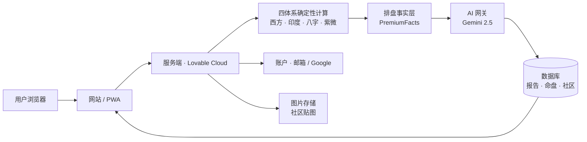

# Fate Nexus 产品与市场协作手册

> 面向市场推广协作者的产品说明、卖点、口径与工作边界。**不是**代码审计文档。

---

## 1. 文档元信息

| 项 | 值 |
| --- | --- |
| 生成日期 | 2026-07-20 |
| 产品中文名 | 命运图书馆 |
| 产品英文名 | Fate Nexus |
| 线上正式站 | https://fate-nexus-ai.lovable.app |
| 预览环境 | https://id-preview--8dd02eb0-ad23-48d1-858e-b5eb297af57e.lovable.app |
| 当前 commit | `60dedb9c39505e2fcb3b9ae2f25d3899a8144efc` |
| 适用读者 | 市场推广、内容运营、社媒、BD、客服 |
| 特别提示 | 仓库中的 `PRD.md` / `PRODUCT.md` / `README.md` 部分口径已**过时**（例如仍写 ¥99 PDF、手机号 OTP）。**以本文档为准**。 |

---

## 2. 30 秒摘要

**命运图书馆**是一款面向中文用户的深度自我探索产品。用户输入出生资料，系统用**西方占星 / 印度占星 / 八字 / 紫微斗数**四大传统一次性排盘，再由 AI 在真实排盘事实之上生成解读。

- 免费：网页版基础报告 + 生命时间轴 + 长老对话 + 社区。
- 付费：**¥79** 一次解锁「高级 AI 综合深度报告」，24 章、约两三万字、永久保存、随时重开、不重复扣费。
- 定位：**文化探索 · 自我反思**，不是算命、不是预测。

**当前推广限制**：支付仍为**模拟支付**（尚未上线真实微信/支付宝/Visa 通道），因此当前阶段主推**内测/共创/预约**口径，不做「立即购买」大规模广告投放。

---

## 3. 品牌背景与产品哲学

### 3.1 品牌故事

命运图书馆把命理传统当作**人类文明的知识馆藏**：每一种体系都是一整套关于"人如何理解自己"的语言。我们不是要证明谁"更准"，而是把四种语言并排放好，让用户在自我叙事里挑选适合自己的那一句。

### 3.2 差异化：四体系合璧

市面上多数产品只做一个体系（西方星座 / 或八字 / 或塔罗），叙述扁平。命运图书馆的核心壁垒是：

- **同一份出生资料**同时进入 4 套确定性计算引擎；
- 系统主动指出"这四种语言在你身上**共识**在哪里 / **张力**在哪里"；
- AI 只解读事实，不发明事实——**AI 永远不算命盘**。

这让报告显著更立体，也是可以持续对外讲的**唯一性叙事**。

### 3.3 产品哲学

1. **文化娱乐 + 自我反思**，不做神断。
2. **诚实的确定性**：排盘用真实天文/历法计算，同一生日永远得到同一份盘。
3. **诚实的 AI 边界**：AI 只写解读文字，事实由代码算出。
4. **一次付费、永久保存**：付费用户随时重开报告不重复扣费。
5. **克制**：不承诺婚姻、财富、健康、灾祸。

---

## 4. 目标客群与使用场景

### 4.1 主要人群

| 客群 | 核心需求 | 场景 |
| --- | --- | --- |
| 25–40 岁一线/新一线女性 | 自我探索、情感梳理、人生节奏感 | 深夜独处、情绪起伏时 |
| 泛灵性/心理成长爱好者 | 系统性的自我语言 | 阅读、写日记、冥想 |
| 命理/占星/八字重度用户 | 想看跨体系一致性 | 与朋友对照讨论 |
| 内容创作者 | 素材、切片、二次表达 | 小红书 / 抖音 / 播客 |
| 心理咨询/教练/HR 从业者 | 自我 & 客户理解辅助 | 工作中的参考视角 |

### 4.2 典型使用场景

- **年末/生日**：想一份"关于我这一年 / 关于我这一生"的解读。
- **人生转折**：换工作、结束一段关系、搬城市。
- **好友互测**：分享报告截图、比较跨体系画像。
- **陪伴时刻**：睡前和"长老"聊几句，写树洞。

---

## 5. 完整用户旅程

```text
[发现]  →  [注册]  →  [开始仪式]  →  [基础报告]  →  [高级报告 ¥79]  →  [永久重开 / 深度使用]
                                     │
                                     ├─ 生命时间轴
                                     ├─ 长老对话 / 树洞
                                     └─ 同门社区
```

| 步骤 | 用户看到 | 价值 | 完成度 | 推广可宣称？ |
| --- | --- | --- | --- | --- |
| **首页** | 品牌氛围、四传统入口、开始仪式 CTA | 快速理解产品 | ✅ 上线 | ✅ |
| **注册 / 登录** | 邮箱 + 密码（含邮件验证），或 Google 一键 | 低门槛 | ✅ 上线 | ⚠️ **邮件送达依赖 Supabase 默认 SMTP，规模化前需接自有邮件通道** |
| **开始仪式（/ritual）** | 姓名、公历生日、出生时间、出生地、性别 | 一次采集，用于所有体系 | ✅ 上线 | ✅ 强调"仪式感 + 一次输入,四体系可用" |
| **确定性排盘** | 一份可视化四传统命盘 | 展示"真的算过" | ✅ 上线 | ✅ |
| **免费网页报告 (/report)** | 四传统解读段落 + 关键要点 | 让用户先尝到味道 | ✅ 上线 | ✅ |
| **生命时间轴** | 折线能量曲线 + 每年可点开详情弹窗 | 让"命运"具象为可读的年度节奏 | ✅ 上线 | ✅ 可作为社媒切片主力 |
| **长老对话 / 树洞** | 一位"长老"陪伴对话；写下心事 | 情绪陪伴、留下痕迹 | ✅ 上线 | ✅ |
| **同门社区 (/community)** | 发帖、评论、点赞、最多 4 张图 | 用户共创、留存 | ✅ 上线 | ✅ 谨慎运营（见 §11） |
| **¥79 高级报告** | 支付台 → 24 章生成进度 → 全屏阅读器 | 深度长文 + 永久保存 | ✅ 功能完备 · ⚠️ **支付为模拟** | ⚠️ 见 §6 与 §8 |
| **个人中心 (AccountModal)** | 命盘列表 / 报告列表 / 删除 / 重开 | 永久资产感 | ✅ 上线 | ✅ 强调"一次付费,随时重读" |

---

## 6. 免费 / 付费边界与当前支付真相

### 6.1 边界

| 免费 | 付费 ¥79 |
| --- | --- |
| 四传统基础网页解读 | **24 章高级 AI 深度报告** |
| 生命时间轴（可点年份看详情） | 报告永久保存、随时重开、不再扣费 |
| 长老对话 / 树洞 | 后续加深章节升级免费重生成 |
| 社区参与 | — |

### 6.2 支付真相（**内部严守**）

- 支付台 UI 目前展示 **微信 / 支付宝 / Visa / 银联** 四种方式，**均为模拟测试通道**，实际不发生真实扣款。
- 服务端要求 `PAYMENT_MODE=mock` 才铸造订单，订单号前缀 `mock_*`。
- **真实微信 / 支付宝 / Visa / 银联 / Apple Pay 均未接入**。
- 生产上线前必须切换真实通道并完成签约、回调验签、退款、发票、税务流程。

### 6.3 对外可 / 不可宣称

| ✅ 可宣称 | ❌ 不可宣称 |
| --- | --- |
| "限量内测 / 早鸟共创" | "已支持微信 / 支付宝 / Visa / Apple Pay" |
| "预约体验,首批赠深度报告" | "立即购买、全球支付" |
| "一次 ¥79,永久保留" | "无理由退款、7 天试用"（政策未定） |

---

## 7. 高级 AI 深度报告：核心卖点

### 7.1 内容价值

- **24 章、约两三万字**，覆盖：开篇 / 执行摘要 / 命盘导览 / 西方本命与相位 / 印度本命与大限 / 八字四柱十神大运 / 紫微宫与流曜 / 跨体系共识 / 跨体系张力 / 性格底色 / 事业 / 财富 / 关系 / 家庭 / 健康 / 人生使命 / 未来 12 个月 / 关键窗口 / 方法论与免责声明。
- 每一章都要求 AI **引用真实事实路径**（例如"八字·日主·丁火"）而不是自由发挥。
- **一次生成，永久保存**：完成后写入数据库，之后重开一律读缓存,**不再消耗任何 AI 额度**。
- 中断可续、失败重试（每章最多 3 次），最终交付完整 24 章。

### 7.2 已验证的一份完整报告

- **Report ID**：`274c92fb-7fdd-490c-8991-c2a02ec81f6f`
- **状态**：24 / 24 章 completed
- **AI 提供方**：Lovable AI Gateway
- **主力模型**：Google Gemini 2.5 Flash;最后 3 章升级为 Gemini 2.5 Pro
- **复开验证**：再次打开时 AI 调用数 = **0**,报告内容哈希不变

> ⚠️ 这是一份**指定测试报告**的通过验证,不等于"我们已经跑过 10 万份"。大规模真实用户压测尚未做,市场投放前需要与开发协商小规模灰度。

### 7.3 推广口径示例

> ✅ "四大传统同时开卷,由 AI 为你写就一部专属的 24 章命运手册,一次读完、永久保存。"
>
> ✅ "AI 只解读、不算命——每一个结论都能追溯回真实排盘。"
>
> ❌ 禁止:"AI 精准预测你的婚姻年份 / 财富数字 / 疾病风险。"

---

## 8. 品牌调性与推广口径

### 8.1 调性关键词

**古典、克制、温度、图书馆、长夜、烛光、羊皮卷、星图、诚实**。

避免:塑料水晶球、金光闪闪、"大师"、"天机"、恐吓式话术、极端情绪化文案。

### 8.2 推荐宣传口径

- "四种古老语言,一次同时开口"
- "命运不是判决,是一本可以反复翻阅的书"
- "AI 只解读,不算命"
- "一次 ¥79,一份属于你的 24 章手册,永久保存"
- "写给愿意认真看看自己的人"

### 8.3 **禁止**宣传口径（红线)

以下承诺**绝对不能**出现在任何广告、直播、KOL 稿件、私信话术中:

- ❌ 保证 / 预测**婚姻**、正缘、桃花对象、必婚年
- ❌ 保证 / 预测**收入**、财富数字、投资回报、股票基金走势
- ❌ 任何**医疗**判断、疾病诊断、寿命预测
- ❌ **灾祸**、意外、生死、劫难预警
- ❌ "唯一正确"、"百分百精准"、"AI 已破解命运"
- ❌ 用他人真实命盘做营销素材（隐私红线)

以上一旦触发,不仅品牌翻车,还有法律与平台风险。**任何合作方文案必须由品牌方审核后发布。**

---

## 9. 市场卖点、内容选题与转化建议

### 9.1 核心卖点(可拆分为多条内容)

1. **四体系合璧**——市面独一份的横向对照。
2. **AI 只解读、不算命**——反"AI 玄学"焦虑。
3. **24 章深度报告**——长内容,便于图文/长视频拆解。
4. **一次付费永久保存**——反订阅疲劳。
5. **生命时间轴**——年度节奏可视化,天然社媒素材。
6. **克制的调性**——差异化于市面上大红大紫的算命号。

### 9.2 内容选题库（示例)

- "同一天出生,四种传统怎么说?"
- "西方星座 vs 紫微斗数:同一件事的两种语言"
- "读懂你的大运:未来 10 年在讲什么故事"
- "跨体系共识/张力：如果四位老师同时坐下来聊你"
- "命运图书馆书评式:24 章我读到了什么"
- "长老树洞:凌晨三点写下的那句话"

### 9.3 社媒平台建议

| 平台 | 内容形态 | 主目标 |
| --- | --- | --- |
| 小红书 | 图文长笔记 + 报告截图切片 | 主拉新 |
| 抖音 / 视频号 | 30–90 秒短视频、"命盘解读一分钟" | 广度曝光 |
| 微博 | 话题运营、KOL 合作 | 事件营销 |
| 播客 | 深度对谈,一期讲一个体系 | 高价值人群 |
| 知乎 | 长回答、专栏 | SEO + 信任建立 |
| 邮件通讯 | 月度"命运图书馆通讯" | 留存(依赖 §17 邮件通道) |

### 9.4 转化漏斗

```text
曝光 → 首页 → 开始仪式(采集出生资料) → 基础报告(体验) → ¥79 高级报告 → 复访(个人中心)
```

关键卡点：

- **首页 → 仪式**:出生资料采集是最大流失点,需情感化文案。
- **基础 → 付费**:必须让用户在基础报告里"看到但吃不够"。
- **付费 → 复访**:靠"永久保存 + 时间轴年度提醒"。

### 9.5 建议核心指标(与开发共同定义)

- 首页访问 → 完成仪式转化率
- 完成仪式 → 打开基础报告
- 打开基础报告 → 打开付费台
- 付费台打开 → 支付成功(**目前为模拟**)
- 已付费 → 7 日 / 30 日复访
- 报告平均阅读章节数
- 社区周活/发帖量/互动率

### 9.6 用户反馈收集

- 报告完成页 & 阅读器底部放"1 句话反馈"入口。
- 社区置顶"共创需求征集"帖。
- 每月一次 5–10 人深访(付费用户优先)。
- 客服/私信话术模板由品牌 + 开发共同维护。

---

## 10. 版本迭代重点（产品语言)

| 阶段 | 面向用户的变化 | 现状 |
| --- | --- | --- |
| 初版上线 | 首页 + 四传统介绍 + 账户 | 已完成 |
| 认证优化 | 邮箱密码 + 邮件验证 + Google 登录;去除手机号 OTP | 已完成 |
| 仪式统一 | 性别等基础信息前移到"开始仪式"一次采集 | 已完成 |
| 命盘管理 | 命盘云端保存、去重、可删除 | 已完成 |
| 付费重塑 | 从"¥99 PDF"改为**"¥79 网页版永久报告"**,不再导出 PDF | 已完成 |
| 报告体验 | 全屏阅读器、目录侧栏、移动端抽屉、桌面 1320px | 已完成 |
| 高级报告引擎 | 24 章逐章生成、断点续跑、失败重试、复开零消耗 | 已完成 |
| 事实层升级 | 四体系周期与流运更完整 | 已完成 |
| 真实 AI 演练 | 完整跑通一份 24/24 真实 AI 报告 | 已完成(单份) |
| 生命时间轴 | 折线 + 点年份看详情弹窗 | 已完成 |
| 同门社区 | 云端发帖、评论、点赞、图片 | 已完成 |
| 社区安全强化 | 2026-07-19 修复:社区点赞数据不再对未登录访客开放 | 已完成 |

---

## 11. 当前完成度矩阵（对外沟通口径)

| 模块 | 状态 | 市场是否可主推 |
| --- | --- | --- |
| 邮箱 / Google 登录 | ✅ 已上线 | 可,但**邮件送达尚未接自有 SMTP** |
| 开始仪式 & 命盘管理 | ✅ 已上线 | 可 |
| 免费基础报告 | ✅ 已上线 | 可 |
| 生命时间轴 & 年度详情 | ✅ 已上线 | 可(推荐主推) |
| 长老对话 / 树洞 | ✅ 已上线 | 可 |
| 同门社区 | ✅ 已上线,基础安全刚修复 | 可,但需先配运营与举报机制 |
| **¥79 高级报告(功能)** | ✅ 24 章跑通 | 可讲功能,但… |
| **¥79 支付通道** | ❌ **仅模拟支付** | ❌ 不得对外声称已接入真实支付 |
| 邮件送达(生产 SMTP) | ⚠️ 依赖 Supabase 默认通道 | 大规模前需替换 |
| 客户端错误监控(Sentry) | ❌ 未接入 | — |
| App 封装 / 上架 | ❌ 未做 | ❌ 不得宣称"App 已上线" |
| 大规模压测与成本控制 | ❌ 未做 | 需灰度 |
| PRD / README 等旧文档口径 | ⚠️ **部分过时** | 以本手册为准 |

---

## 12. 上线与市场投放前检查清单

**在做任何"付费购买"导向的公开投放前**,以下必须全部 ✅：

- [ ] 真实支付通道(至少微信 + 支付宝)接入完成、回调验签、退款流程跑通
- [ ] `PAYMENT_MODE=mock` 已在生产环境关闭
- [ ] 邮件送达替换为自有 SMTP,域名 SPF / DKIM / DMARC 配置到位
- [ ] 用户协议、隐私政策、退款政策由法务确认(尤其"娱乐用途 / 非医疗投资建议")
- [ ] 客服话术与红线口径手册发放到所有 KOL 与内部人员
- [ ] 24 章报告小规模灰度(≥ 20 位真实用户)全部通过
- [ ] Sentry 或同等错误监控已接
- [ ] 社区举报 / 屏蔽 / 违规处理流程上线
- [ ] 出生资料相关的**隐私删除**流程被至少一位真实用户走通
- [ ] 品牌视觉素材、Logo、宣传主图、KV、备案信息就位

---

## 13. 简化技术架构

> 只保留一张图 + 三段摘要。详细技术细节由开发维护,市场无需掌握。



### 13.1 数据隐私

- 出生资料属**敏感个人信息**,仅本人可读。
- 数据库层做严格 owner 隔离,AI 请求不发送姓名之外的 PII。
- 社区图片经签名 URL 分发,单图 ≤ 5MB,单帖 ≤ 4 张。
- 用户可删除命盘 / 单份报告(账号级注销流程需在上线前跑通一次)。

### 13.2 AI 事实边界

- **AI 从不计算命盘**,四体系全部由代码算出。
- AI 只写解读文字,并被要求引用真实事实路径。
- 相同出生资料 + 相同语言,永远得到相同的排盘,不受 AI 版本影响。

### 13.3 当前技术限制

- 西方占星目前采用 **Whole Sign 整宫制**(已在报告中明示);Placidus / Koch 等分宫制尚未接入,不要在物料中承诺"支持任意分宫制"。
- 报告导出为 PDF / 长图目前未开放(需要外部服务),因此**不要宣称"下载 PDF"**。
- AI 单份报告的成本、并发上限、失败率在大规模真实用户下的表现尚未压测。

---

## 14. 下一阶段路线（面向市场沟通)

| 优先级 | 事项 | 市场意义 |
| --- | --- | --- |
| P0 | 接入真实支付(微信 + 支付宝优先) | 才可以做"立即购买"广告 |
| P0 | 邮件生产 SMTP + 域名认证 | 保证注册、找回密码送达 |
| P0 | 隐私合规、退款政策、备案 | 广告平台开户前置 |
| P1 | AI 成本 & 并发压测、灰度扩量 | 保证爆量时不崩 |
| P1 | 错误监控(Sentry) | 快速响应事故 |
| P1 | 社区运营机制 + 内容审核 | 支撑 UGC |
| P2 | App 封装 / iOS · 安卓上架 | 推"命运图书馆 App"心智 |
| P2 | 会员制或家人/伴侣多命盘套餐 | 二次变现 |

---

## 15. 常见问答（FAQ · 对外话术)

**Q1 这是算命吗?**
不是。我们把命理传统当作文化馆藏,提供解读语言,帮助你更好地认识自己。

**Q2 AI 会替代命理师吗?**
不会。AI 只在真实排盘之上写文字,它不"看事",它"翻译"事。

**Q3 ¥79 之后还会不会再扣费?**
不会。同一份命盘的高级报告只解锁一次,随时打开都不再消耗。

**Q4 我可以删除我的资料吗?**
可以。个人中心支持删除命盘与报告;账号级注销通道正在完善。

**Q5 你们能预测我今年会不会结婚 / 发财吗?**
不能,也不做这件事。我们提供的是"节奏与视角",不是保证。

**Q6 有 App 吗?**
目前是网页版(可添加到手机主屏幕),原生 App 在规划中。

**Q7 支持微信支付吗?**
目前处于内测阶段,支付通道正在陆续接入。请关注官方账号获取上线通知。

---

## 16. 术语表

| 术语 | 一句话解释 |
| --- | --- |
| 命盘 | 由出生资料算出的四体系星象/命理图 |
| 事实(Facts) | 代码算出的确定性数据,AI 不能修改 |
| 章节(Chapter) | 高级报告 24 个组成单元中的一个 |
| 大运 / Dasha | 印度占星 / 八字里的多年阶段 |
| 四化 | 紫微斗数中禄 / 权 / 科 / 忌四种能量标签 |
| Whole Sign | 西方占星"整宫制",本项目采用的分宫方式 |
| 复开零消耗 | 已完成报告再次打开时 AI 调用为 0 |

---

## 17. 什么时候必须联系开发

市场协作者遇到以下情况**必须**在动作前联系开发/产品:

1. **文案涉及 AI 能力边界** — 涉及"预测"、"精准"、"AI 算命"等表述前。
2. **对外宣布支付上线** — 无论渠道大小。
3. **对外宣布 App 上架** — 无论 iOS/安卓。
4. **上外部推广渠道**(信息流、KOL、直播、CPS) — 需要联合审校物料。
5. **用户投诉/举报涉及隐私、退款、未成年人、算命误导** — 立刻升级。
6. **需要真实用户命盘作为素材** — 必须先取得书面授权。
7. **需要压测流量**(大 V 转发预告、活动预约) — 提前 3 天知会以便扩容与观察。
8. **数据统计口径变更**(定义"付费用户"、"活跃用户") — 与开发确认取数逻辑。
9. **需要修改 PRD / README / 官网 About** — 先同步产品口径。
10. **看到本手册与实际产品不一致** — **一定要说**,以本手册未来版本为准。

---

## 附录 A · 关键入口 / 页面地图

面向市场,只需要知道下面这些路径:

| 入口 | 路径 | 用途 |
| --- | --- | --- |
| 首页 | `/` | 品牌落地 |
| 关于 | `/about` | 品牌故事 |
| 四传统介绍 | `/traditions` | 教育内容 |
| 注册 / 登录 | `/auth` | 账户 |
| 开始仪式 | `/ritual` | 采集出生资料 |
| 基础报告 | `/report` | 免费四体系解读 |
| 综合视图 | `/synthesis` | 跨体系汇总 |
| 同门社区 | `/community` | UGC |
| 隐私政策 | `/privacy` | 合规文案 |
| 用户协议 | `/terms` | 合规文案 |
| 账号注销 | `/delete-account` | 隐私出口 |
| 个人中心 | 首页右上角头像 → AccountModal | 命盘 / 报告管理 |
| 高级报告入口 | 基础报告页 · "解锁完整报告 ¥79" 卡片 | 付费入口(当前模拟) |
| 高级报告阅读器 | 完成后点击"查看完整报告" · 全屏弹层 | 深度阅读 |

## 附录 B · 内部资料索引(需要时找开发要)

以下文档主要面向开发,市场无需通读,遇到问题时可按名索取:

1. `PRD.md` — 早期产品需求文档(**部分口径过时**)
2. `PRODUCT.md` — 早期产品说明(**部分口径过时**)
3. `README.md` — 早期开发说明(**部分口径过时**)
4. `AGENTS.md` — AI Agent 协作说明
5. `skills/fate-nexus-premium-report/SKILL.md` — 24 章报告契约
6. `skills/fate-nexus-premium-report/references/chapter-manifest.md` — 24 章目录
7. `skills/fate-nexus-premium-report/references/evidence-contract.md` — 事实引用规则
8. `skills/fate-nexus-premium-report/references/token-cache-policy.md` — AI 成本与缓存策略
9. `supabase/migrations/` — 数据库版本历史
10. `src/routes/` — 页面路由目录

---

## 版本与信息来源

- 快照日期:**2026-07-20**
- 参考 commit:`60dedb9c39505e2fcb3b9ae2f25d3899a8144efc`
- 数据来源:当前仓库源码、`skills/` 文档、Lovable 会话历史
- 声明:仓库中的 `PRD.md` / `PRODUCT.md` / `README.md` 部分历史口径(如 ¥99 PDF、手机号 OTP、导出 PDF)已过时,**以本文档为准**;下一次改动请同步更新本手册。
